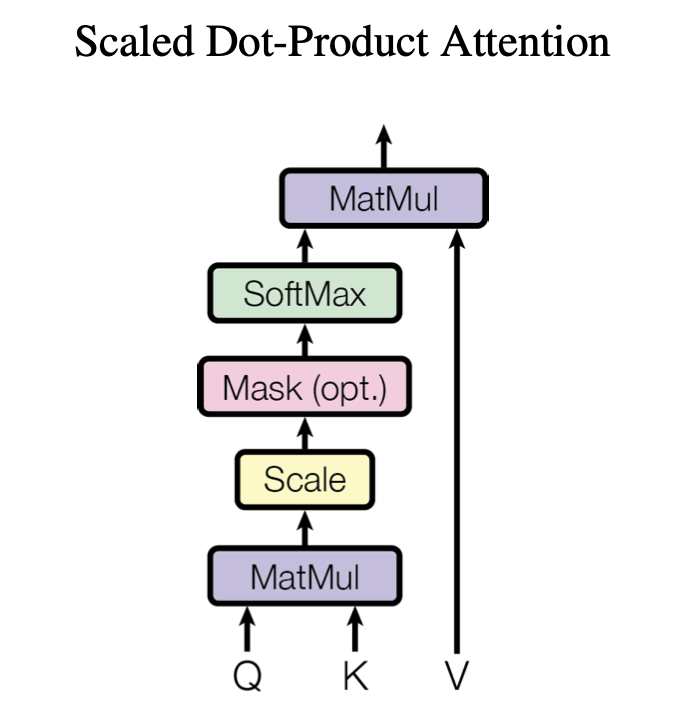
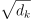

# Трансформер
## Задача 1. Реализация Модуля SDPA (Scaled Dot-Product Attention)

  
  
 
  <em> "Attention Is All You Need" by Ashish Vaswani et al., published in 2017</em>

#### Задача:
Необходимо реализовать SDPA в Pytorch, используя формулу, представленную выше. Эта задача включает в себя следующие пункты:
1.  Инициализация Softmax:
     * Реализовать инициализацию softmax в конструкторе класса SDPA (model/transformer.py).
     * Используйте `nn.Softmax` модуль с правильным измерением для применения softmax.

2. Расчет Attention Scores:
     * Написать код для расчета скалярного произведения `Q` и `K^T` (транспонированного `K`).
     * Масштабировать результат с помощью 
     * Применить softmax к полученным значениям для получения коэффициентов внимания.
3. Расчет Выходного Тензора:
     * Реализовать умножение коэффициентов внимания на матрицу `V`.

## Задача 2. Реализация Модуля MHA 

  
  
 
  <em> "Attention Is All You Need" by Ashish Vaswani et al., published in 2017</em>

#### Задача:
Необходимо реализовать MHA в Pytorch, используя формулу, представленную выше. Эта задача включает в себя следующие пункты:
1.  Реализация SHA (Single Head Attention):
     * Дополните инициализацию линейных преобразований для Q, K и V в конструкторе класса SHA (model/transformer.py).
     * Реализуйте метод forward, который выполняет линейные преобразования на Q, K, V и затем применяет SDPA.

2. Реализация MHA (Multi-Head Attention):
     * Инициализируйте в классе MHA список модулей SHA, равный количеству голов внимания.
     * Дополните инициализацию линейного преобразования для объединения выходов всех головок внимания.
     * Реализуйте метод forward, который вычисляет выходы каждого модуля SHA и затем объединяет их, применяя линейное преобразование.

